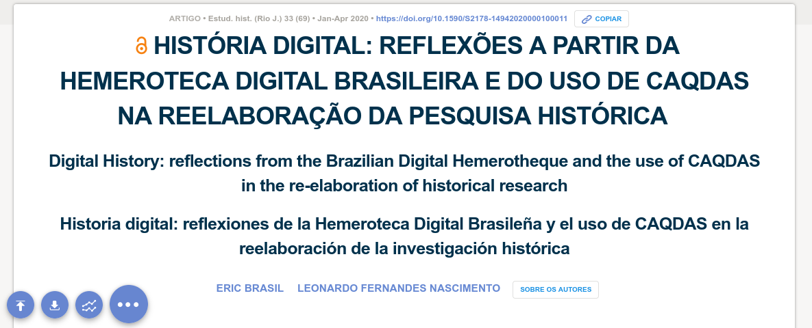

layout: true

```{r setup, include=FALSE}
options(htmltools.dir.version = FALSE)

knitr::opts_chunk$set(
	echo = FALSE,
	fig.align = "center",
	message = FALSE,
	warning = FALSE,
	cache = FALSE
)
```

```{r eval=FALSE, include=FALSE}
library(knitr)
library(tidyverse)
library(widgetframe)
```

---
class: inverse, center, middle

# As fontes digitais de pesquisa

---
class: middle, center

## Traços digitais (digital data trace)

```{r, out.width="75%"}
knitr::include_graphics("img/socioloy.png")
```

---
class: middle, center

## Dataficação

```{r, out.width="75%"}
knitr::include_graphics("img/datafication4.jpg")
```

---
class: middle, center

## Digitalização de fontes históricas


```{r, out.width="65%"}
knitr::include_graphics("img/surv.jpg")
```

---
class: inverse, center, middle

# O caso da Hemeroteca Digital da Biblioteca Nacional

---
class: middle, center

## Difusão nas pesquisas em história

```{r, out.width="30%"}
knitr::include_graphics("img/noun_data search_1509987.png")
```

---
class: middle, center

## Acesso aos periódicos remotamente 
<br>
--

## Busca por palavras
<br>
--

## Salvar imagens
<br>

---
class: middle, center

## Mas e as citações?
<br>
--

## Sem padrão e sem transparência  
<br>
--

## O caso dos papers da Anpuh e artigos no Scielo.br

---
class: middle, center

## Interface da HDB e seus impactos epistemológicos

```{r, out.width="30%"}
knitr::include_graphics("img/noun_Fishing_3839395.png")
```

---
class: middle, center

## Parâmetros de busca 
<br>
--

## Padrão de resultados
<br>
--

## OCR, XML, Metadados?
<br>

---
class: middle, center

## Por uma heurística digital


```{r, out.width="30%"}
knitr::include_graphics("img/noun_algorithm_3048214.png")
```

---
class: middle, center

## Registro de procedimentos metodológicos 
<br>
--

## Potencial de pesquisas com técnicas de DH
<br>

---
class: inverse, center, middle

# Para finalizar: Qual futuro da pesquisa histórica?

---
class: middle, center

## Seremos todos programadores?
<br>

---
class: middle, center  

```{r, out.width="70%"}

```

## História digital: reflexões a partir da Hemeroteca Digital Brasileira e do uso de CAQDAS na reelaboração da pesquisa histórica.

Revista Estudos Históricos, v. 33, n. 69, p. 196–219, jan. 2020. 

[Clique para acessar]( https://doi.org/10.1590/S2178-14942020000100011 ) 

---
class: middle, center  

# Leonardo F. Nascimento

### [Email: **leofn3@gmail.com**](mailto:leofn3@gmail.com) 

### [Twitter:**@leofn3**](http://www.twitter.com/leofn3) 

### [website: **www.leofn.com**](http://www.leofn.com)

---
class: middle, center  

# Eric Brasil

### [Email: **profericbrasil@unilab.edu.br**](mailto:profericbrasil@unilab.edu.br) 

### [Twitter:**@ericbrasiln**](http://www.twitter.com/ericbrailn) 

### [website: **ericbrasiln.github.io**](https://ericbrasiln.github.io/)

---
class: middle, center  

```{r, out.width="20%"}
knitr::include_graphics("img/logo_MA_color.png")
```

## Laboratório de Humanidades Digitais da UFBA

**Twitter**: [@labhdufba](https://twitter.com/labhdufba) 
<br>
**Instagram**: [@labhdufba](http://instagram.com/labhdufba)
<br>
**Github**: [https://github.com/LABHDUFBA](https://github.com/LABHDUFBA)
<br>
**Youtube**: [https://www.youtube.com/c/LABHDUFBA](https://www.youtube.com/c/LABHDUFBA)

---
class: middle, center

## Obrigado gente!

.pull-left[
```{r, out.width="50%"}
knitr::include_graphics("https://media.giphy.com/media/JQRVMKkWAQbdiXFBkg/giphy.gif")
```
]
.pull-right[
##**Agradecimentos especiais**:
<br>

### Ao Iuri Lapa pelo convite e a todos os funcionários e funcionárias que trabalham diariamente para manter essa instituição tão fundamental para a sociedade brasileira.
<br>

### Ao público pela paciência!
]

