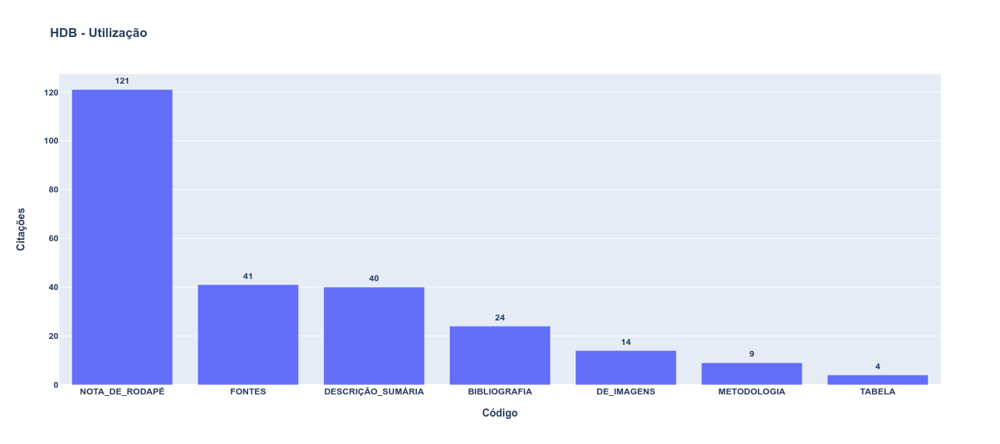

layout: true

```{r setup, include=FALSE}
options(htmltools.dir.version = FALSE)

knitr::opts_chunk$set(
	echo = FALSE,
	fig.align = "center",
	message = FALSE,
	warning = FALSE,
	cache = FALSE
)
```

```{r eval=FALSE, include=FALSE}
library(knitr)
library(tidyverse)
library(widgetframe)
```
---
class: inverse, center, middle

# Qual futuro da pesquisa histórica?

---
class: inverse, center, middle

# "Digital turn" nas humanidades
<br>

```{r, out.width="75%"}
knitr::include_graphics("https://media.giphy.com/media/FqdGGgugkC4Xm/giphy.gif")
```

---
class: inverse2, center, middle

# Dataficação (Mayer-Schönberger e Cukier, 2013)
<br>

--
```{r, out.width="75%"}
knitr::include_graphics("https://media.giphy.com/media/l41YvpiA9uMWw5AMU/giphy.gif")
```

---
class: inverse2, center, middle

# Digitalização das fontes históricas
<br>

--
## rematerialização
<br>

--
## dados e metadados
<br>

--
## "mutação epistemológica fundamental"
<br>

---
class: inverse, center, middle

# O caso da Hemeroteca Digital da Biblioteca Nacional

```{r, out.width="45%"}
knitr::include_graphics("img/noun_data search_1509987.png")
```

---
class: inverse2, center, middle

# Difusão nas pesquisas em história
<br>
--

## Acesso aos periódicos remotamente 
<br>
--

## Salvar imagens
<br>
--

## Busca por palavras
<br>

---
class: inverse2, middle, center

# Mas e as citações?
<br>

--
## Sem padrão e sem transparência  

---
class: inverse2, middle, center

## O caso dos papers da Anpuh
<br>

### Pesquisa realizada por Ana Carolina Veloso, bolsista PIBIC / FAPESB.

### Para mais informações [clique aqui](https://ericbrasiln.github.io/pibic_2020-2021/hdb/)

---
class: inverse2, middle, center

## Papers publicados nos Anais dos SNH da Anpuh com ocorrências dos termos vínculados à HDB por evento

```{r, out.width="100%"}
knitr::include_graphics("img/newplot(2).png")
```

---
class: inverse2, middle, center

## Padrões de utilização dos termos vínculados à HDB nas citações encontradas

```{r, out.width="100%"}

```

---
class: inverse, middle, center

## Interface da HDB e seus impactos epistemológicos
<br>

```{r, out.width="45%"}
knitr::include_graphics("img/noun_Fishing_3839395.png")
```

---
class: inverse2, middle, center

## Parâmetros de busca 
<br>

--
## Padrão de resultados
<br>

--
## OCR, XML, Metadados?
<br>

---
class: inverse, middle, center

# Por uma heurística digital
<br>

```{r, out.width="45%"}

```

---
class: inverse2, middle, center

## Registro de procedimentos metodológicos 
<br>
--

## Potencial de pesquisas com técnicas de DH
<br>

--
## Seremos todos programadores?
<br>

---
class: inverse2, middle, center 

```{r, out.width="70%"}
knitr::include_graphics("img/artigo.png")
```

### História digital: reflexões a partir da Hemeroteca Digital Brasileira e do uso de CAQDAS na reelaboração da pesquisa histórica.

Revista Estudos Históricos, v. 33, n. 69, p. 196–219, jan. 2020. 

[Clique para acessar]( https://doi.org/10.1590/S2178-14942020000100011 ) 

---
class: inverse2, middle, center

# Leonardo F. Nascimento

### [Email: **leofn3@gmail.com**](mailto:leofn3@gmail.com) 

### [Twitter:**@leofn3**](http://www.twitter.com/leofn3) 

### [website: **www.leofn.com**](http://www.leofn.com)

---
class: inverse2, middle, center

# Eric Brasil

### [Email: **profericbrasil@unilab.edu.br**](mailto:profericbrasil@unilab.edu.br) 

### [Twitter:**@ericbrasiln**](http://www.twitter.com/ericbrailn) 

### [website: **ericbrasiln.github.io**](https://ericbrasiln.github.io/)

---
class: inverse2, middle, center

```{r, out.width="20%"}
knitr::include_graphics("img/logo_MA_color.png")
```

## Laboratório de Humanidades Digitais da UFBA

**Twitter**: [@labhdufba](https://twitter.com/labhdufba) 
<br>
**Instagram**: [@labhdufba](http://instagram.com/labhdufba)
<br>
**Github**: [https://github.com/LABHDUFBA](https://github.com/LABHDUFBA)
<br>
**Youtube**: [https://www.youtube.com/c/LABHDUFBA](https://www.youtube.com/c/LABHDUFBA)

---
class: inverse2, middle, center

# **Obrigado gente!**

.pull-left[
```{r, out.width="100%"}
knitr::include_graphics("https://extra.globo.com/incoming/23459478-c2d-e53/w976h550-PROP/76651138_rsrio-de-janeiro-rj08-05-2017bibliotecas-da-cidadebiblioteca-nacional.-foto.jpg")
```
]
.pull-right[
## Agradecimentos especiais:
<br>

### Ao Iuri Lapa pelo convite e a todos os funcionários e funcionárias que trabalham diariamente para manter essa instituição tão fundamental para a sociedade brasileira.
<br>

]

